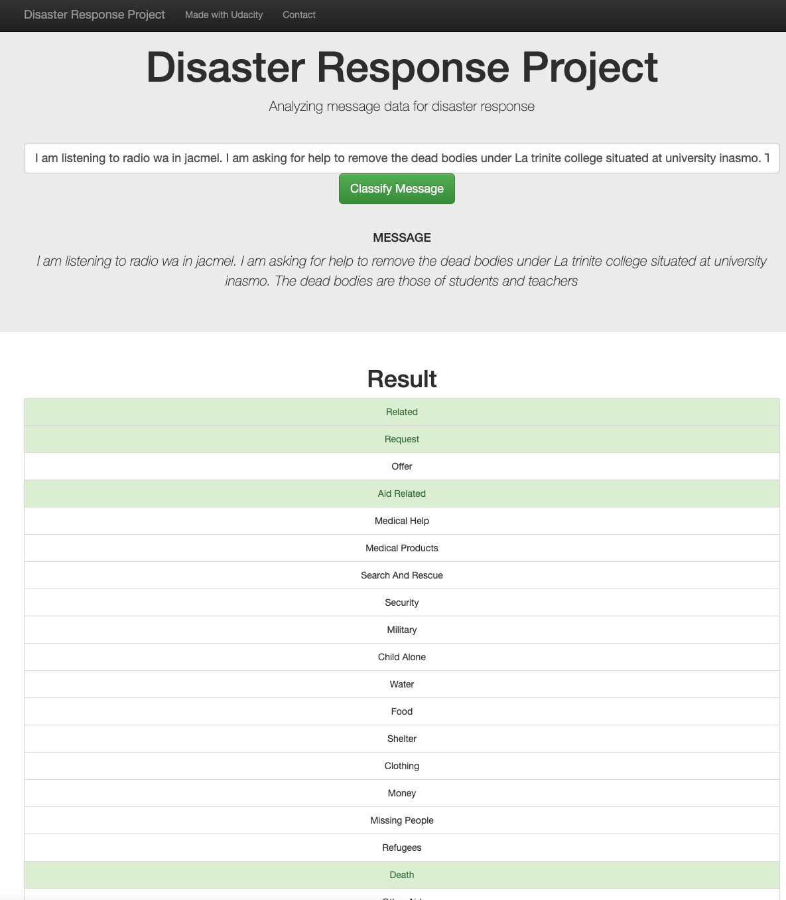
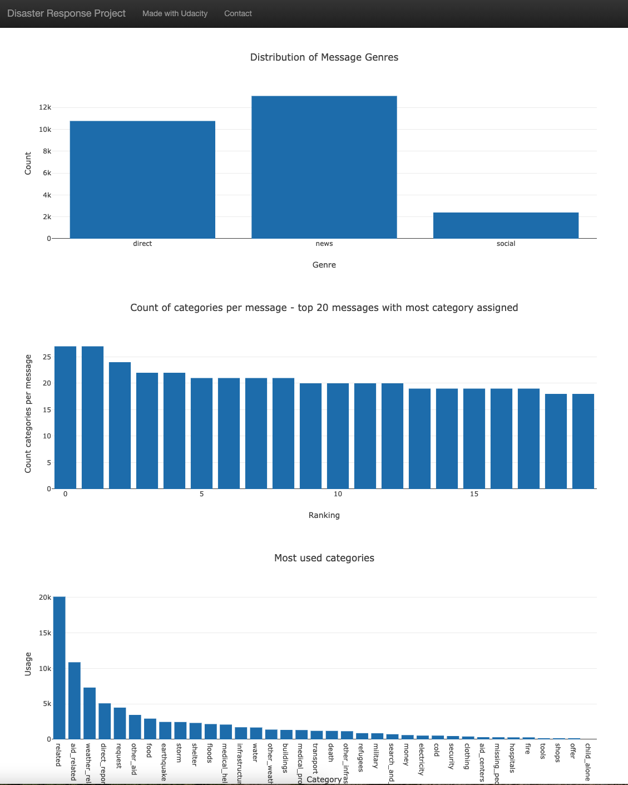

# Disaster Response Pipeline Project
## Project:
This project has been created as a part of the Data Science Nonedegree Program by Udacity. The main goal is to provide a pipeline processing a pre-labeled dataset of messages and predicted disaster categories to which each particular message could be related to.

## Project structure:
The project is divided into three main sections:
1. ETL pipeline extracting data from different sources, merging it, cleaning and storing data into a SQLite database.
2. ML pipeline to train a NLP model. This includes text preparation, tokenizing, lemmatizing. All step are integrated into one pipeline.
3. Web app to predict disaster related categories for any user typed message.

## File structure:

- [data/process_data.py](data/process_data.py) implementing the ETL pipeline.
- [models/train_classifier.py](models/train_classifier.py) implementing the ML pipeline.
- [app/run.py](app/run.py) starting the web app.

## Instructions:
### Dependencies
- Python 3 (3.8)
- SQLlite Database Libraqries: SQLalchemy
- Machine Learning Libraries: Pandas, NumPy, Sciki-Learn
- Natural Language Process Libraries: NLTK
- Web App and Data Visualization: Plotly (plotly-2.4.2, src="https://cdn.plot.ly/plotly-2.4.2.min.js"), Flask

### Steps to execute
1. Run the following commands in the project's root directory to set up the database and model.

    - To run ETL pipeline that cleans data and stores in database
        `python data/process_data.py data/disaster_messages.csv data/disaster_categories.csv data/response.db`
    - To run ML pipeline that trains classifier and saves
        `python models/train_classifier.py data/response.db models/model.pkl`

2. Run the following command in the app's directory to run your web app.
    `python run.py`

3. Go to http://0.0.0.0:3001/

4. Insert any message in order to classify disaster categories. See example: 

## Dataset:
Provided by the company Figure Eight. Some insights:

## Acknowledgment:
Thanks Udacity for the inspiration and Figure Eight for the dataset. 

